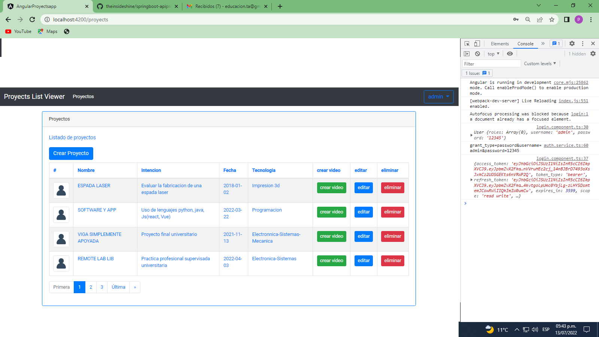
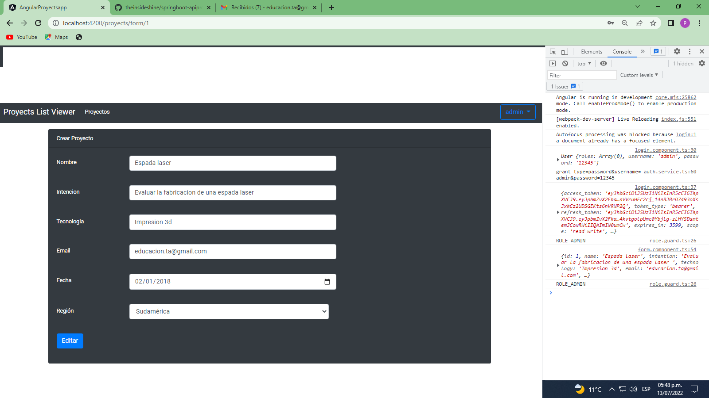
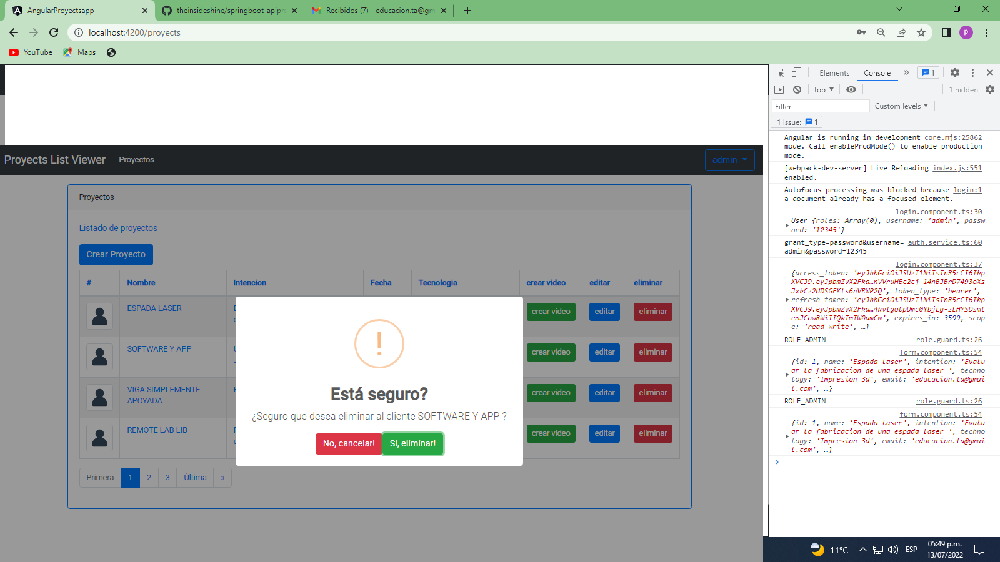
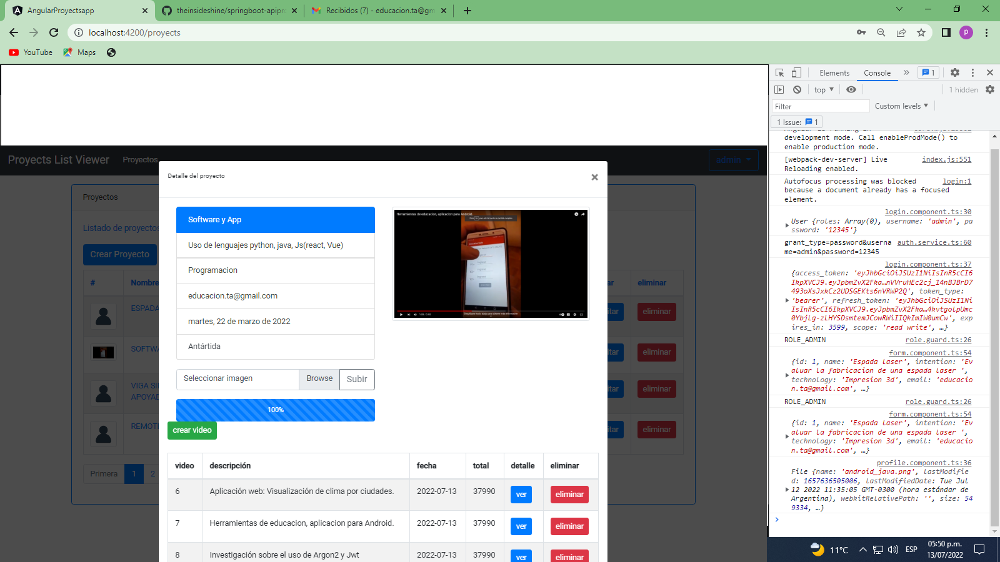
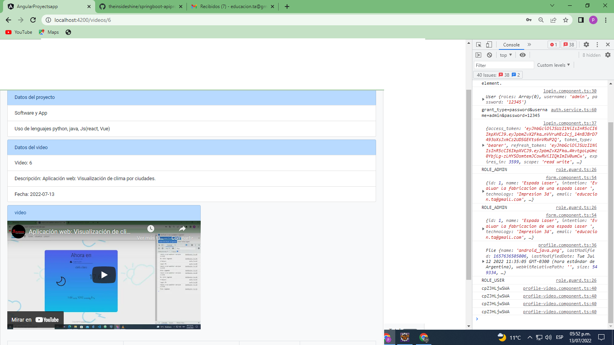
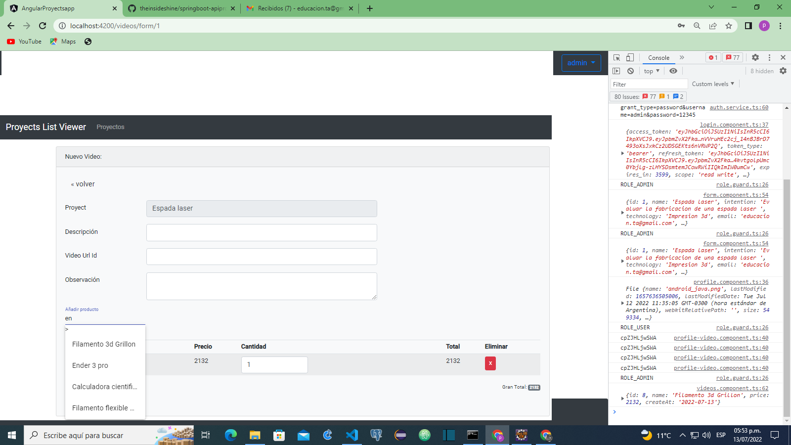
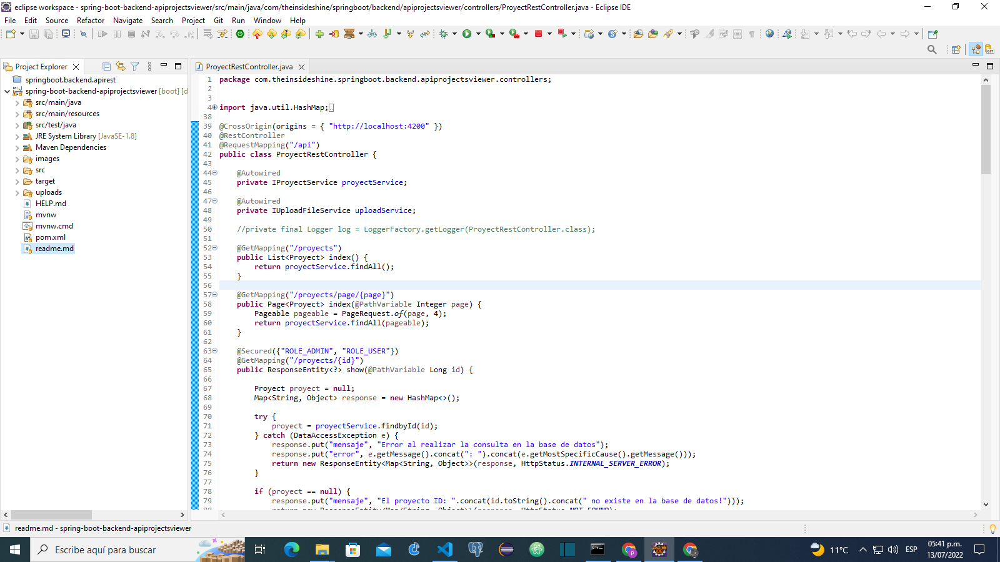
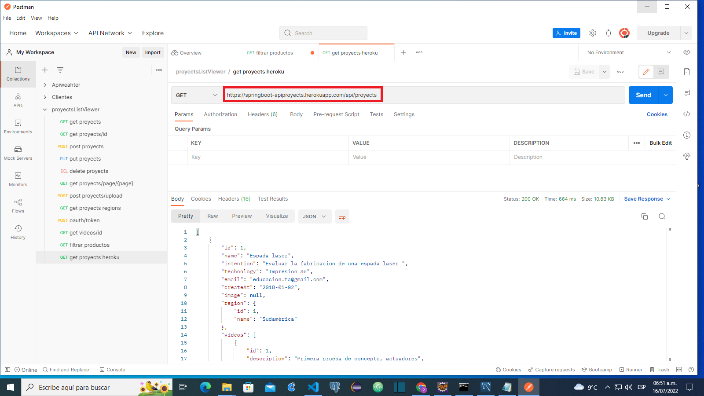

# Angular-proyectApp
Lista de video de proyectos

La intención del proyecto es familiarizarse con el uso de SpringBoot , SpringSecurity
, Spring data jpa, y angular, bootstrap

[demo de uso](https://youtu.be/TfWqM0VwJNs)

Lista principal de proyectos

Formulario de creacion/edicion de proyectos

Borrado de proyectos

Perfil del proyecto

Detalles del video

Crear video

Spring/Eclipse

Despliegue Heroku

Repositorio servidor
![]https://github.com/theinsideshine/springboot-apiproyects

EL servidor tarda unos 10 segundos en levantar, cuando entra en reposo.
[Aplicacion](https://proyect-app-angular-46890.web.app/)
